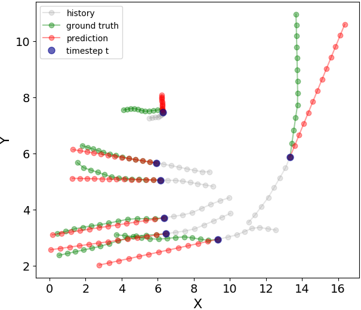
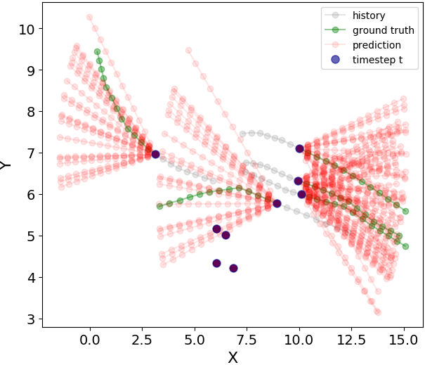

## Constant Velocity Pedestrian Motion Prediction

This repository contains an implementation of the Constant Velocity Model from paper:

[What the Constant Velocity Model Can Teach Us About Pedestrian Motion Prediction](https://arxiv.org/abs/1903.07933) 
Christoph Schöller, Vincent Aravantinos, Florian Lay, Alois Knoll 
Robotics and Automation Letters (RA-L), 2020

In particular, it allows to reproduce the results for **OUR** and **OUR-S** from Table 1. The dataset in this repository is the same as the one provided [here](https://github.com/agrimgupta92/sgan), but converted to json format.

 

Prediction examples of **OUR** (left) and **OUR-S** (right):

**Note**: The old title of the paper was "The Simpler the Better: Constant Velocity for Pedestrian Motion Prediction"
